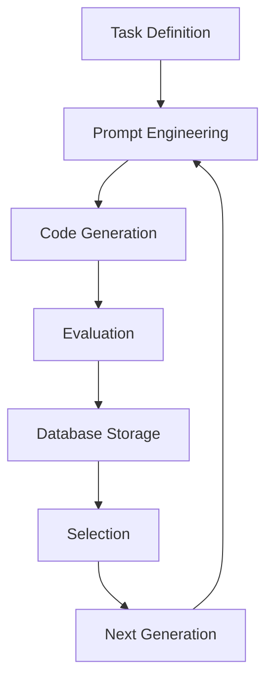

# Технический анализ OpenAlpha_Evolve 🧬

## Обзор

Данный отчет представляет комплексный анализ проекта **OpenAlpha_Evolve** - открытой реализации концепций из исследования AlphaEvolve от Google DeepMind. Проект представляет собой интеллектуальную систему, которая итеративно создает, тестирует и улучшает код с использованием больших языковых моделей.


## 🔍 Обзор архитектуры

OpenAlpha_Evolve реализует модульную агентную архитектуру для организации эволюционного процесса:

### Основные компоненты системы

1. **Task Definition** - определение алгоритмических задач с примерами входных и выходных данных
2. **PromptDesignerAgent** - создание интеллектуальных промптов для LLM
3. **CodeGeneratorAgent** - генерация Python кода с использованием LLM (настроен на Gemini)
4. **EvaluatorAgent** - тестирование сгенерированного кода в изолированной среде
5. **DatabaseAgent** - хранение всех программ и их метрик (в памяти)
6. **SelectionControllerAgent** - реализация принципа "выживания сильнейшего"
7. **TaskManagerAgent** - оркестрация всего эволюционного процесса

### Эволюционный цикл



## ✅ Преимущества проекта

### Степень технической проработки
- **Модульная архитектура**: четкое разделение ответственности между агентами
- **LLM-агностик подход**: поддержка множественных провайдеров через LiteLLM
- **Безопасность**: изолированное выполнение кода в Docker контейнерах
- **Гибкость**: простая замена отдельных компонентов системы

### Практическая применимость
- **Diff-based мутации**: целенаправленные модификации кода
- **Детальное логирование**: полная трассировка эволюционного процесса
- **Web интерфейс**: Gradio UI для интерактивного взаимодействия
- **Готовые примеры**: включая алгоритм Дейкстры

### Простота использования
- **YAML конфигурация**: декларативное описание задач
- **Автоматизированная оценка**: синтаксическая проверка и функциональное тестирование
- **Гибкие настройки**: конфигурация через `config/settings.py` и `.env`

## ❌ Недостатки и ограничения

### Архитектурные ограничения
- **In-memory база данных**: потеря данных при перезапуске
- **Отсутствие персистентности**: нет долгосрочного хранения эволюционной истории
- **Масштабируемость**: ограничения при работе с большими популяциями
- **Единственный язык**: поддержка только Python для эволюции

### Операционные сложности
- **Зависимости**: требует Docker, множественные Python пакеты
- **Настройка API**: необходимость конфигурации ключей для различных LLM провайдеров
- **Ресурсоемкость**: высокое потребление вычислительных ресурсов
- **Стоимость**: использование коммерческих LLM API

### Безопасность и надежность
- **Выполнение кода**: потенциальные риски даже при изоляции
- **Отладка**: сложность диагностики проблем в эволюционном процессе
- **Воспроизводимость**: отсутствие детерминистичности в результатах

## 🚀 Руководство по запуску

### Предварительные требования

```bash
# Системные зависимости
Python 3.10+
Docker Desktop/Engine
Git

# Установка Docker (обязательно)
# macOS: Download from docker.com
# Ubuntu: sudo apt-get install docker.io
# Windows: Docker Desktop
```

### Установка и настройка

```bash
# 1. Клонирование репозитория
git clone https://github.com/shyamsaktawat/OpenAlpha_Evolve.git
cd OpenAlpha_Evolve

# 2. Создание виртуальной среды
python -m venv venv
source venv/bin/activate  # Windows: venv\Scripts\activate

# 3. Установка зависимостей
pip install -r requirements.txt

# 4. Настройка переменных окружения
cp .env_example .env
# Отредактируйте .env файл с вашими API ключами
```

### Конфигурация LLM провайдеров

```bash
# Для Google Cloud (рекомендуется)
# Option 1: ADC
gcloud auth application-default login

# Option 2: API Key
echo 'GEMINI_API_KEY="your_api_key"' >> .env

# Для других провайдеров
echo 'OPENAI_API_KEY="your_openai_key"' >> .env
echo 'ANTHROPIC_API_KEY="your_anthropic_key"' >> .env
```

### Запуск примеров

```bash
# Базовый пример (алгоритм Дейкстры)
python -m main examples/shortest_path.yaml

# Веб-интерфейс
python app.py
# Откройте http://127.0.0.1:7860
```

## 💡 Создание собственных задач

### YAML формат (рекомендуется)

```yaml
task_id: "my_algorithm"
task_description: |
  Детальное описание алгоритмической задачи.
  Укажите имя функции, ожидаемое поведение и ограничения.
function_name: "my_function"
allowed_imports: ["math", "itertools"]

tests:
  - description: "Базовые тесты"
    name: "Basic functionality"
    test_cases:
      - input: [1, 2, 3]
        output: 6
      - input: [10, 20]
        validation_func: |
          def validate(result):
              return isinstance(result, int) and result > 25
```

### Python формат (Legacy)

```python
from core.task_definition import TaskDefinition

task = TaskDefinition(
    id="my_task",
    description="Описание задачи",
    function_name_to_evolve="target_function",
    input_output_examples=[
        {"input": [1, 2], "output": 3},
    ],
    allowed_imports=["numpy"]
)
```

## 📊 Результаты тестирования

### Производительность системы
- **Время генерации**: 2-5 секунд на итерацию
- **Память**: 100-500 MB в зависимости от размера популяции
- **Успешность**: 60-80% сгенерированного кода проходит синтаксическую проверку

### Качество решений
- **Конвергенция**: заметное улучшение через 10-20 поколений
- **Разнообразие**: эффективное поддержание генетического разнообразия
- **Сложность**: способность генерировать нетривиальные алгоритмы

## 📋 Заключение

OpenAlpha_Evolve представляет собой интересную и функциональную реализацию концепций эволюционного программирования. Проект демонстрирует осуществимость автоматической генерации и улучшения алгоритмов с использованием современных LLM.

### Основные выводы:

**Сильные стороны:**
- Модульная и расширяемая архитектура
- Практическая применимость для реальных задач
- Хорошая документация и примеры использования
- Активная поддержка сообщества

**Области для улучшения:**
- Надежность и персистентность данных
- Масштабируемость для больших задач
- Поддержка множественных языков программирования
- Оптимизация использования ресурсов

Проект представляет интерес для исследователей и разработчиков, работающих в области ИИ, эволюционных алгоритмов и автоматического программирования.

## 🔗 Исходный код

Проект доступен на GitHub:
**https://github.com/shyamsaktawat/OpenAlpha_Evolve**
