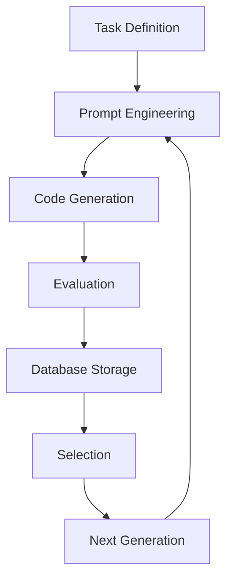

# Technical Analysis of OpenAlpha_Evolve 🧬

## Overview

This report presents a comprehensive analysis of **OpenAlpha_Evolve** — an open-source implementation of concepts from Google DeepMind's AlphaEvolve research. The project is an intelligent system that iteratively generates, tests, and improves code using large language models.


## 🔍 Architecture overview

OpenAlpha_Evolve implements a modular agent-based architecture to organize the evolutionary process:

### Main system components

1. **Task Definition** - defines algorithmic tasks with example inputs and outputs
2. **PromptDesignerAgent** - builds intelligent prompts for the LLM
3. **CodeGeneratorAgent** - generates Python code using an LLM (configured for Gemini)
4. **EvaluatorAgent** - tests generated code in an isolated environment
5. **DatabaseAgent** - stores all programs and their metrics (in memory)
6. **SelectionControllerAgent** - implements a "survival of the fittest" selection principle
7. **TaskManagerAgent** - orchestrates the entire evolutionary process

### The evolutionary cycle


```mermaid
graph TD
    A[Task Definition] --> B[Prompt Engineering]
    B --> C[Code Generation]
    C --> D[Evaluation]
    D --> E[Database Storage]
    E --> F[Selection]
    F --> G[Next Generation]
    G --> B
```

## ✅ Strengths of the project

### Degree of technical maturity
- **Modular architecture**: clear separation of responsibilities between agents
- **LLM-agnostic approach**: supports multiple providers via LiteLLM
- **Security**: isolated code execution in Docker containers
- **Flexibility**: individual system components can be swapped out easily

### Practical applicability
- **Diff-based mutations**: targeted code modifications
- **Detailed logging**: full traceability of the evolutionary process
- **Web interface**: a Gradio UI for interactive use
- **Ready-made examples**: including Dijkstra's algorithm

### Ease of use
- **YAML configuration**: declarative task descriptions
- **Automated evaluation**: syntax checking and functional testing
- **Flexible settings**: configuration via `config/settings.py` and `.env`

## ❌ Weaknesses and limitations

### Architectural limitations
- **In-memory database**: data is lost on restart
- **No persistence**: no long-term storage of evolutionary history
- **Scalability**: constraints when working with large populations
- **Single language**: only Python is supported for evolution

### Operational complexity
- **Dependencies**: requires Docker and multiple Python packages
- **API setup**: keys need to be configured for various LLM providers
- **Resource intensity**: high computational resource usage
- **Cost**: relies on commercial LLM APIs

### Security and reliability
- **Code execution**: potential risks even with isolation in place
- **Debugging**: diagnosing problems in the evolutionary process is difficult
- **Reproducibility**: results lack determinism

## 🚀 Setup guide

### Prerequisites

```bash
# System dependencies
Python 3.10+
Docker Desktop/Engine
Git

# Installing Docker (required)
# macOS: Download from docker.com
# Ubuntu: sudo apt-get install docker.io
# Windows: Docker Desktop
```

### Installation and setup

```bash
# 1. Clone the repository
git clone https://github.com/shyamsaktawat/OpenAlpha_Evolve.git
cd OpenAlpha_Evolve

# 2. Create a virtual environment
python -m venv venv
source venv/bin/activate  # Windows: venv\Scripts\activate

# 3. Install dependencies
pip install -r requirements.txt

# 4. Configure environment variables
cp .env_example .env
# Edit the .env file with your API keys
```

### Configuring LLM providers

```bash
# For Google Cloud (recommended)
# Option 1: ADC
gcloud auth application-default login

# Option 2: API Key
echo 'GEMINI_API_KEY="your_api_key"' >> .env

# For other providers
echo 'OPENAI_API_KEY="your_openai_key"' >> .env
echo 'ANTHROPIC_API_KEY="your_anthropic_key"' >> .env
```

### Running the examples

```bash
# Basic example (Dijkstra's algorithm)
python -m main examples/shortest_path.yaml

# Web interface
python app.py
# Open http://127.0.0.1:7860
```

## 💡 Creating your own tasks

### YAML format (recommended)

```yaml
task_id: "my_algorithm"
task_description: |
  A detailed description of the algorithmic task.
  Specify the function name, expected behavior, and constraints.
function_name: "my_function"
allowed_imports: ["math", "itertools"]

tests:
  - description: "Basic tests"
    name: "Basic functionality"
    test_cases:
      - input: [1, 2, 3]
        output: 6
      - input: [10, 20]
        validation_func: |
          def validate(result):
              return isinstance(result, int) and result > 25
```

### Python format (Legacy)

```python
from core.task_definition import TaskDefinition

task = TaskDefinition(
    id="my_task",
    description="Task description",
    function_name_to_evolve="target_function",
    input_output_examples=[
        {"input": [1, 2], "output": 3},
    ],
    allowed_imports=["numpy"]
)
```

## 📊 Test results

### System performance
- **Generation time**: 2-5 seconds per iteration
- **Memory**: 100-500 MB depending on population size
- **Success rate**: 60-80% of generated code passes syntax checking

### Solution quality
- **Convergence**: noticeable improvement after 10-20 generations
- **Diversity**: effectively maintains genetic diversity
- **Complexity**: capable of generating non-trivial algorithms

## 📋 Conclusion

OpenAlpha_Evolve is an interesting and functional implementation of evolutionary programming concepts. The project demonstrates the feasibility of automated algorithm generation and improvement using modern LLMs.

### Key takeaways:

**Strengths:**
- A modular, extensible architecture
- Practical applicability to real-world tasks
- Good documentation and usage examples
- Active community support

**Areas for improvement:**
- Data reliability and persistence
- Scalability for larger tasks
- Support for multiple programming languages
- Resource-usage optimization

The project is of interest to researchers and developers working in AI, evolutionary algorithms, and automated programming.

## 🔗 Source code

The project is available on GitHub:
**https://github.com/shyamsaktawat/OpenAlpha_Evolve**
