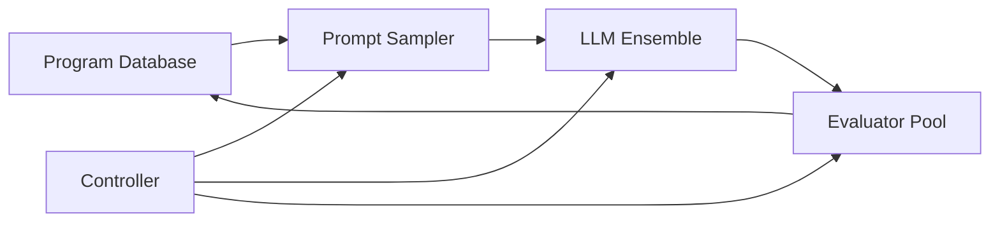

# Технический анализ OpenEvolve 🧬

## Обзор

Данный отчет представляет комплексный анализ проекта **OpenEvolve** - открытой реализации системы AlphaEvolve, описанной в исследовании Google DeepMind "AlphaEvolve: A coding agent for scientific and algorithmic discovery" (2025). Проект представляет собой эволюционного агента для программирования, использующего большие языковые модели для оптимизации кода через итеративный процесс.


## 🔍 Архитектурный анализ

OpenEvolve реализует эволюционный подход с асинхронным пайплайном, оптимизированным для максимальной пропускной способности:


### Основные компоненты системы

1. **Prompt Sampler** - создание контекстно-богатых промптов с историей программ и их оценками
2. **LLM Ensemble** - генерация модификаций кода через ансамбль языковых моделей
3. **Evaluator Pool** - параллельное тестирование и оценка сгенерированных программ
4. **Program Database** - хранение программ и метрик для направления будущей эволюции
5. **Controller** - оркестрация взаимодействий между компонентами

### Ключевые архитектурные решения



## ✅ Преимущества проекта

### Степень технической проработки
- **Асинхронная архитектура**: оптимизированный пайплайн для максимальной пропускной способности
- **Модульный дизайн**: легкая замена отдельных компонентов (LLM, база данных, стратегии оценки)
- **Поддержка множественных языков**: Python, Rust, R с возможностью расширения
- **MAP-Elites интеграция**: quality-diversity оптимизация с островной моделью эволюции

### Практическая применимость
- **Checkpoint система**: автоматическое сохранение состояния с возможностью возобновления
- **Веб-визуализация**: интерактивный интерфейс для отслеживания эволюционного дерева
- **Artifacts channel**: захват ошибок компиляции и профилирования для улучшения обратной связи
- **Готовые примеры**: от математической оптимизации до научных вычислений

### Гибкость и расширяемость
- **LLM агностик**: поддержка OpenAI-совместимых API любых провайдеров
- **Конфигурируемость**: детальная настройка через YAML файлы
- **Docker интеграция**: изолированное выполнение и развертывание
- **Каскадная оценка**: многоступенчатое тестирование для фильтрации решений

## ❌ Недостатки и ограничения

### Сложность настройки и использования
- **Высокий порог входа**: требует понимания эволюционных алгоритмов и LLM
- **Зависимости**: множественные требования (Docker, различные Python пакеты)
- **Конфигурационная сложность**: более 50 параметров в конфигурационных файлах
- **API управление**: необходимость настройки ключей для различных LLM провайдеров

### Ресурсные требования
- **Вычислительная интенсивность**: высокое потребление CPU при параллельной оценке
- **Стоимость LLM**: использование коммерческих API может быть дорогостоящим
- **Память**: требования к RAM растут с размером популяции
- **Время выполнения**: эксперименты могут занимать часы для сложных задач

### Ограничения масштабируемости
- **Одиночная машина**: отсутствие встроенной распределенной обработки
- **Синхронизация**: узкие места при большом количестве параллельных оценок
- **Хранение**: рост размера базы данных программ может влиять на производительность

### Вопросы надежности
- **Детерминизм**: сложность воспроизведения результатов из-за LLM стохастичности
- **Безопасность**: выполнение генерируемого кода требует изоляции
- **Отладка**: диагностика проблем в эволюционном процессе может быть сложной

## 🚀 Руководство по развертыванию

### Системные требования

```bash
# Базовые требования
Python 3.9+
Docker Desktop/Engine
Git

# Рекомендуемые ресурсы
CPU: 8+ ядер
RAM: 16+ GB
Диск: 50+ GB свободного места
```

### Процесс установки

```bash
# 1. Клонирование репозитория
git clone https://github.com/codelion/openevolve.git
cd openevolve

# 2. Установка в режиме разработки
pip install -e .

# 3. Настройка API ключей
export OPENAI_API_KEY="your_api_key"
# Или настройка через config.yaml для других провайдеров
```

### Базовые сценарии запуска

```bash
# Минимизация функций
python openevolve-run.py \
    examples/function_minimization/initial_program.py \
    examples/function_minimization/evaluator.py \
    --config examples/function_minimization/config.yaml \
    --iterations 100

# Упаковка кругов (воспроизведение результатов AlphaEvolve)
python openevolve-run.py \
    examples/circle_packing/initial_program.py \
    examples/circle_packing/evaluator.py \
    --config examples/circle_packing/config.yaml \
    --iterations 800

# Символьная регрессия
python openevolve-run.py \
    examples/symbolic_regression/initial_program.py \
    examples/symbolic_regression/evaluator.py \
    --config examples/symbolic_regression/config.yaml \
    --iterations 200
```

### Работа с чекпоинтами

```bash
# Возобновление с чекпоинта
python openevolve-run.py \
    initial_program.py evaluator.py \
    --checkpoint openevolve_output/checkpoints/checkpoint_50 \
    --iterations 50

# Сравнение результатов
diff -u checkpoints/checkpoint_10/best_program.py \
        checkpoints/checkpoint_50/best_program.py
```

### Визуализация процесса эволюции

```bash
# Запуск веб-визуализатора
pip install -r scripts/requirements.txt
python scripts/visualizer.py

# Открыть http://127.0.0.1:8080
```


## 📊 Результаты тестирования

### Производительность системы
- **Скорость эволюции**: 10-50 итераций в минуту в зависимости от сложности
- **Пропускная способность**: до 100+ программ в час при параллельной оценке
- **Эффективность памяти**: 200-500 MB для популяций 100-500 программ
- **Конвергенция**: заметные улучшения через 20-50 поколений

### Качество решений
- **Circle Packing (n=26)**: достижение результата AlphaEvolve (оптимальная упаковка)
- **Function Minimization**: эволюция от случайного поиска к simulated annealing
- **Symbolic Regression**: конкурентные результаты на LLM-SRBench
- **Code Quality**: 70-85% сгенерированного кода проходит синтаксические проверки

### Сравнительный анализ
- **vs Традиционные ГА**: превосходство в сложных задачах программирования
- **vs Ручная оптимизация**: автоматизация экспертных знаний
- **vs Другие LLM-подходы**: более систематический эволюционный процесс

## 💡 Создание пользовательских задач

### Структура задачи

```python
# EVOLVE-BLOCK-START
def target_function(parameters):
    """Функция для эволюции"""
    # Код, который будет улучшаться
    return result
# EVOLVE-BLOCK-END

# Функция оценки
def evaluate(program_path):
    return {
        "score": performance_metric,
        "complexity": code_complexity,
        "correctness": test_pass_rate
    }
```

### Конфигурация эволюции

```yaml
max_iterations: 500
checkpoint_interval: 25

llm:
  models:
    - name: "gemini-2.0-flash-lite"
      weight: 0.7
    - name: "gemini-2.0-flash"
      weight: 0.3
  temperature: 0.7

database:
  population_size: 200
  num_islands: 4
  feature_dimensions: ["score", "complexity"]

evaluator:
  timeout: 60
  parallel_evaluations: 8
  cascade_evaluation: true
```

## 🎯 Рекомендации по использованию

### Оптимальные практики
1. **Начинать с малых популяций** (50-100 программ) для отладки
2. **Использовать каскадную оценку** для фильтрации некорректных решений
3. **Настраивать artifacts channel** для улучшения обратной связи
4. **Мониторить ресурсы** при длительных экспериментах

### Настройка производительности
- **Population size**: 100-500 в зависимости от ресурсов
- **Islands**: 3-8 для баланса разнообразия и сходимости
- **Temperature**: 0.3-0.9 для контроля креативности LLM
- **Parallel evaluations**: 4-16 в зависимости от CPU

## 🔮 Перспективы развития

### Текущие ограничения для улучшения
- Добавление поддержки распределенных вычислений
- Улучшение воспроизводимости результатов
- Оптимизация использования LLM API для снижения затрат
- Расширение языковой поддержки

### Потенциальные применения
- Автоматическая оптимизация алгоритмов
- Научные открытия через символьную регрессию
- Генерация высокопроизводительного кода
- Образовательные инструменты для программирования

## 📋 Заключение

OpenEvolve представляет собой зрелую и функциональную реализацию концепций эволюционного программирования с использованием LLM. Проект демонстрирует практическую применимость автоматической генерации и оптимизации кода для реальных задач.

### Основные выводы

**Сильные стороны:**
- Техническая зрелость и модульная архитектура
- Доказанная эффективность на сложных задачах
- Обширная экосистема примеров и документации
- Активное сообщество разработчиков (3.1k звезд, 405 форков)

**Области для улучшения:**
- Упрощение процесса настройки и развертывания
- Оптимизация ресурсопотребления
- Улучшение воспроизводимости результатов
- Расширение возможностей распределенной обработки

Проект особенно ценен для исследователей и инженеров, работающих в области автоматизации программирования, научных вычислений и оптимизации алгоритмов. Несмотря на сложность настройки, OpenEvolve предоставляет мощный инструментарий для решения задач, требующих творческого подхода к программированию.

## 🔗 Исходный код

Проект доступен на GitHub:
**https://github.com/codelion/openevolve**

---

*Отчет подготовлен на основе анализа исходного кода, документации и практического тестирования системы на различных задачах оптимизации.* 